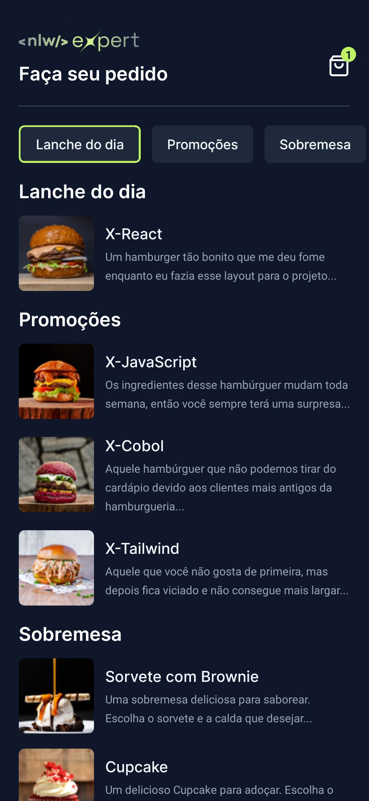
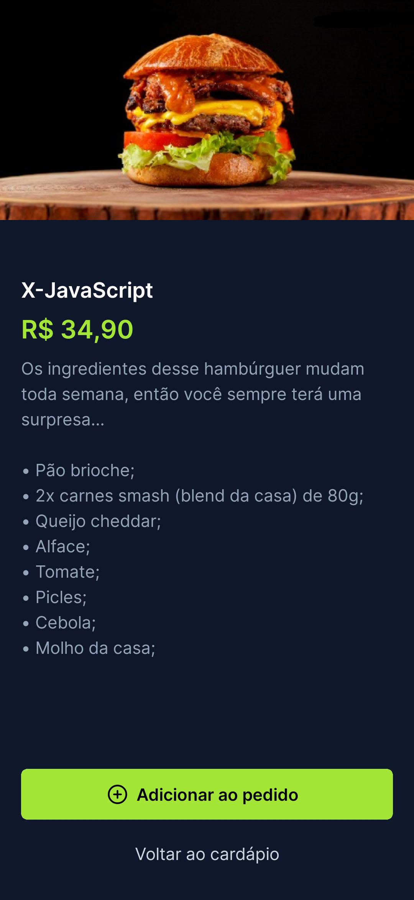
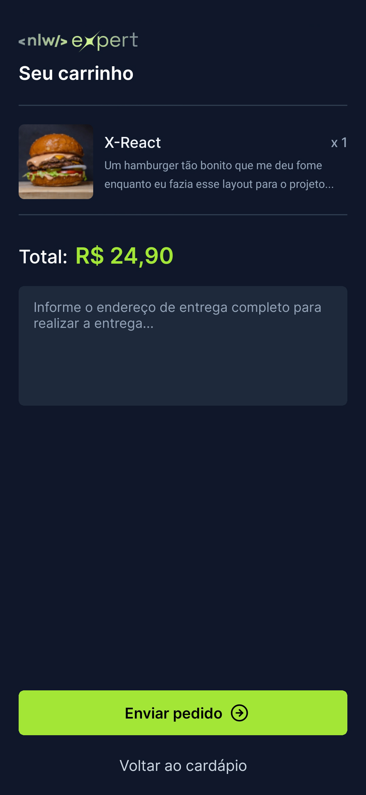

# Movies Lib
  

  - [1. Project Description](#1-project-description)
  - [2. Layouts](#2-layouts)
    - [2.1. Main Page](#21-main-page)
    - [2.2. Item Information](#22-item-information)
    - [2.3. Cart](#23-cart)
  - [3. Prerequisites](#3-prerequisites)
    - [3.1. Node.js](#31-nodejs)
  - [4. Installation](#4-installation)
    - [4.1. Clone the Repository](#41-clone-the-repository)
    - [4.2. Access the project directory](#42-acess-the-project-directory)
    - [4.3. Install the Dependencies](#43-install-the-dependencies)
  
## 1. Project Description
Native mobile application developed with [React Native](https://reactnative.dev/) for both Android and iOS that resembles a food delivery, in which the user can view the menu, add the items of interest to the cart and finally forward the order to the restaurant via WhatsApp to place the order.
## 2. Layouts

### 2.1 Main Page


### 2.2 Item Information


### 2.3 Movie Details


## 3. Prerequisites
### 3.1 Node.js
> Download and install [Node.js](https://nodejs.org/)
   
## 4. Installation
### 4.1 Clone the Repository
   ```sh
   git clone https://github.com/Naanon/expert-delivery
   ```
### 4.2 Access the project directory  
   ```sh
   cd expert-delivery
   ```
### 4.3 Install the Dependencies
   > Mobile Application Dependencies
   ```sh
   npm install
   ```
